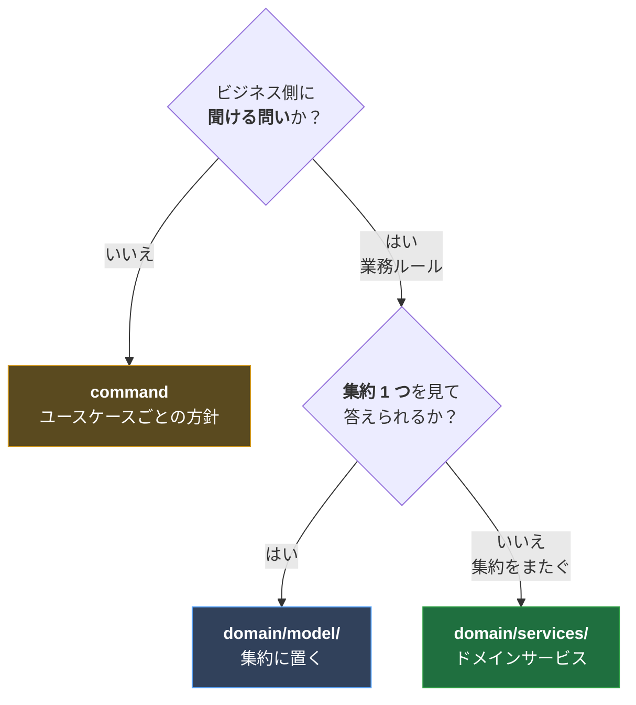

# ドメインサービス

**業務ルールをどこに置くか。** 集約か、ドメインサービスか、command か。

番号を振っていないのは、[`../★境界と越境/`](../★境界と越境/) と同じ理由。
他の `docs/NN-*.md` が「どうなっているか」を書くのに対し、ここは
**「次に迷ったとき、どう決めるか」**を書く。

- [一意性の守り方](一意性の守り方.md) — 事前チェックと DB 制約の二段構え（実測あり）
- [迷った判断/](迷った判断/)

---

## 定義

**集約をまたぐ業務ルール**を置く。集約 1 つを見ても判断できない不変条件は、
エンティティにも値オブジェクトにも属さないため（Evans の Service の定義）。

ルールに名前を与えて 1 箇所に集め、**「呼ぶ順序」だけを command に残す**。
依存するのは `domain/` のポートだけなので、層の向きは内向きのまま保たれる
（I/O を伴うことは戻り値の `R` に現れる）。

---

## 判断の順序

### ① ビジネス側に聞ける問いか

聞けるなら業務ルール。聞けないならユースケースの方針。

| 問い                                                   | 聞けるか | 置き場                      |
| ------------------------------------------------------ | :------: | --------------------------- |
| 「同じメアドの人が 2 人居ていいですか？」              |    ✓     | 業務ルール → ②へ            |
| 「パスワード変更時に現在のパスワードを確認しますか？」 |    ✓     | 業務ルール → ②へ            |
| 「存在しない ID を指定されたらどうしますか？」         |    ✗     | **command**（`orNotFound`） |

「対象が居なければ 404」は業務の問いではない。**HTTP をどう見せるかの方針**。

### ② 集約 1 つを見て答えられるか

**ドメインサービスは「業務ルールの既定の置き場」ではない。**
単一の集約を見れば答えが出る問いは、集約に置く。

---

## いま置いてあるもの

| 名前                          | またぐもの                    | `R`（必要な依存）                  |
| ----------------------------- | ----------------------------- | ---------------------------------- |
| `checkMailAddressDuplication` | 自分と**他の全利用者**        | `UserRepository`                   |
| `checkUserIsSelf`             | **対象と actor** の 2 つの id | なし（純粋な比較）                 |
| `verifyCredentials`           | **引き当て**と照合            | `UserRepository \| PasswordHasher` |

### `checkMailAddressDuplication`

「同じメールアドレスのユーザーは 2 人存在しない」。
**`User` 集約 1 つを見ても「他に同じメアドの人が居るか」は判断できない。**
最も素直な例。→ [一意性の守り方](一意性の守り方.md)

### `checkUserIsSelf`

「利用者は自分自身の情報だけを変更できる」。

**`R` が空**なのが目を引く。I/O が無く、`target === actor` を比べるだけ。
それでもドメインサービスなのは、**対象と actor という 2 つの id が要る**から。
集約にも値オブジェクトにも属さない。

しかも**集約を読む前に走らなければならない**。「認可の失敗は対象の有無に関わらず 403」
と決めたので、対象を引く前に落とす必要がある。集約のメソッドにすると
**集約を読んでからでないと呼べない**ので、この順序が表現できない。

> `R` が空でもドメインサービスになりうる。**I/O の有無は判断材料ではない。**

### `verifyCredentials`

「このメールアドレスとパスワードの組は誰か」。
**まず引き当てが要る**ので集約 1 つでは判断できない。
→ [迷った判断](迷った判断/資格情報の照合をどこに置くか.md)

---

## 置かないもの

### `verifyUserPassword` → 集約（`domain/model/user.ts`）

「渡された平文が、このユーザーの現在のパスワードか」。

ビジネス側に聞ける問い（「パスワード変更時に現在のパスワードを確認しますか？」）
なので**業務ルールではある**。それでも `User` 1 つを見れば判定できるため、
ドメインサービスにはしない。

### `orNotFound` → command（`shared/application/`）

「対象が居なければ 404」。**業務の問いではない**ので command 側の方針。

3 箇所（`updateUser` / `deleteUser` / `changePassword`）に現れたため
`shared/application/or-not-found.ts` に切り出した。
`findUserOrFail`（リポジトリを内側に持つ形）にしなかったのは、それだと
コマンド経路しか吸収できず、同じ形の判断をしている `getUserController`（Query 経路）が
残ってしまうから。変換だけを切り出せば経路を問わず使え、
結果として user コンテキスト固有でもなくなる。

---

## 技術サービスの有無は判断材料にしない

`PasswordHasher` が要るかどうかで置き場を変えない。
`createUser` が `UuidGenerator` を、`changeUserProfile` が `Clock` を要求するのと同じく、
**必要な副作用は戻り値の `R` に現れるだけ**。

逆向きも同じ。`checkUserIsSelf` は `R` が空だが、それを理由に値オブジェクトへ
降ろしたりはしない。**置き場を決めるのは「何をまたぐか」だけ。**

---

## 命名: `check<対象>Duplication`

一意性の検証はこの形に統一する（例: `checkMailAddressDuplication`）。

- 失敗するかどうか・何で失敗するかは **Effect の型（`E` チャネル）が語る**ので、
  名前は「何を見るか」だけを言う。`ensure` は .NET/Rust では「満たさなければ落とす」だが
  Go/k8s では「無ければ作る」を意味し、さらに Effect には別物の `ensuring`
  （ファイナライザ）があるため避けた。
- `validate*` は presentation 層の契約スキーマ検証（`validateJson` / `validateParams`）で
  使うため避ける。

一意性以外も `check<何を見るか>` に揃えている（`checkUserIsSelf`）。
**「何を見るか」を言い、「どうなるか」は言わない。**
