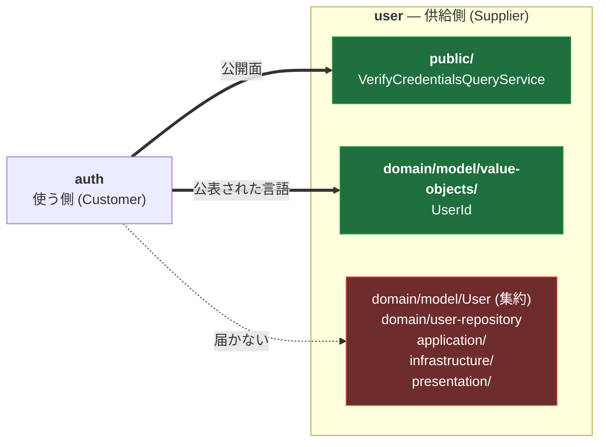
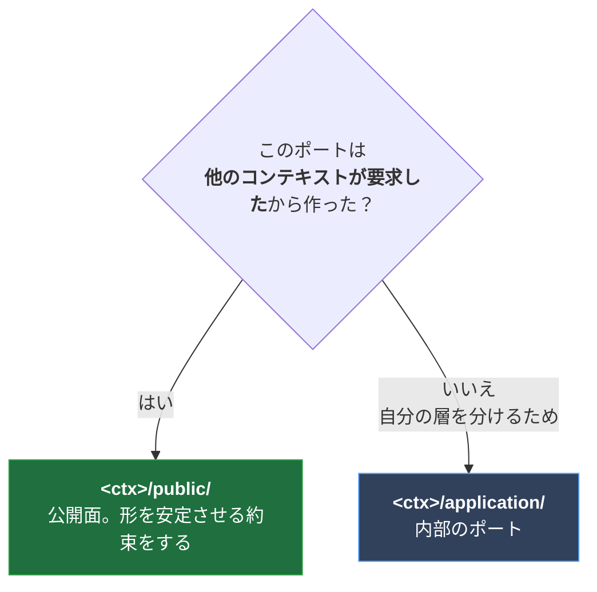

# 境界と越境

**コンテキストを跨ぐとき、何を渡してよくて、何を渡してはいけないか。**

番号を振っていないのは、このフォルダが層や機能の解説ではなく
**判断の仕方**を扱うため。他の `docs/NN-*.md` は「どうなっているか」を書くが、
ここは「次に迷ったとき、どう決めるか」を書く。

- [用語集](用語集.md) — 腐敗防止層 / 公開ホストサービス / god interface など
- [迷った判断/](迷った判断/) — 実際に迷って、どちらかに倒した記録

---

## 結論から

| 越えるもの                          | 可否 | 理由                                        |
| ----------------------------------- | :--: | ------------------------------------------- |
| `<ctx>/public/` のポート            |  ✓   | **供給側が形を制御している**                |
| `<ctx>/domain/model/value-objects/` |  ✓   | **変わる理由がない。** 権限も付いてこない   |
| `domain/` の集約                    |  ✗   | 相手の業務ルールが変わると壊れる            |
| `domain/` のリポジトリ              |  ✗   | `create` / `deleteById` まで握ることになる  |
| `application/`                      |  ✗   | 内部の手順。公開したいなら `public/` へ置く |
| `infrastructure/` / `presentation/` |  ✗   | 実装の詳細                                  |

強制しているのは `.dependency-cruiser.mjs` の `cross-context-public-only`。
仕組みは [`../03-boundary-enforcement.md`](../03-boundary-enforcement.md#コンテキスト跨ぎ--dependency-cruiser-にしか書けないルール)。

---

## なぜこの線なのか

理由は 2 つしかない。**権限**と**結合**。

### リポジトリを渡さない理由 → 権限

`UserRepository` には `create` / `updateProfile` / `deleteById` が付いてくる。
渡した瞬間、**auth が user のテーブルに書ける**。`checkMailAddressDuplication` も
集約の不変条件も、全部 user の command 側にあるので、リポジトリを直接叩けば迂回できる。

> The purpose of an aggregate root is to ensure the consistency of the aggregate;
> it should be **the only entry point for updates**.
> — [Microsoft: Designing a microservice domain model](https://learn.microsoft.com/en-us/dotnet/architecture/microservices/microservice-ddd-cqrs-patterns/microservice-domain-model)

「更新の唯一の入口」を保つには、**入口へのアクセスを配らない**しかない。

### 集約を渡さない理由 → 結合

集約は**書き込みモデル**で、業務ルールが変わると形が変わる。auth が `User` に
依存していたら、**user 側の都合で auth が壊れる**。

しかも余計なものが見える。`User` を渡せば `hashedPassword` も渡ることになり、
「auth 側で照合すればよくない？」という誘惑が生まれる。実際そうしないために、
`VerifyCredentialsQueryService` は `Option<UserId>` だけを返す。

### 値オブジェクトを渡してよい理由

**振る舞いもライフサイクルも持たない。** 渡しても書き込み権限が付いてこないし、
業務ルールが変わっても形が変わらない。`UserId` は uuid v7 の形をした識別子、それだけ。

集約は ID で参照する、という DDD の定石そのもの
（[Vernon, Effective Aggregate Design Part II](https://dddcommunity.org/wp-content/uploads/files/pdf_articles/Vernon_2011_2.pdf)）。
`RefreshToken` が `userId: UserId` を持つのがこの経路。

---

## どこに置くかの判断

**`public/` は「ポート置き場」ではない。「越境してよい面」の宣言。**

`GetUserQueryService` はポートだが `application/` にある。あれは
「application が infrastructure を知らないため」に切ったもので、
要求者が user 自身だから（→ [迷った判断](迷った判断/GetUserQueryServiceを公開するか.md)）。

置く向きは **Customer/Supplier**。使う側の要求を、供給側が受けて公開する。
**誰も要求していないのに公開するのは向きが逆。**

> `public/` に置く ＝ **「この形を、あなたのために安定させ続けます」という約束**。

---

## 全部を貫く 1 つの問い

境界の話に限らず、この repo の設計判断はほぼこれ 1 つに還元できる。

> ### それが変わる理由は、誰の側にあるか。

| 判断                               | 変わる理由が誰にあるか                           |
| ---------------------------------- | ------------------------------------------------ |
| コマンドが `{ id }` を返す         | **user 自身**。契約の都合ではない                |
| 集約を越境させない                 | 相手の業務ルール → **自分の側にない**            |
| 値オブジェクトは越境してよい       | **変わる理由がそもそも無い**                     |
| `GetUserQueryService` を公開しない | **user の HTTP 契約**にある                      |
| decode 失敗を `orDie` にする       | 契約とドメインは**別々に変わる**。ズレたら鳴らす |

「レイヤードアーキテクチャ」も「CQRS」も「境界づけられたコンテキスト」も、
**この問いへの答えを構造にしたもの**。用語を覚えるのではなく、毎回この問いを立てる。

---

## 注意: 一次情報には書いていない

2026-08-12 に確認した。**CQRS は、コンテキスト跨ぎの参照について何も言っていない。**

CQRS が言うのは「データの読み取りと書き込みのモデルを分離する」ことだけで、
Microsoft のガイダンスにも「他コンテキストのリポジトリを触るな」とは書いていない。
そもそもあちらは 1 コンテキスト = 1 マイクロサービス = 1 DB が前提なので、
**この問題が物理的に起きない**（モジュラーモノリスは言語レベルで触れてしまう）。

つまりここに書いてあるのは、**規約ではなくこの repo の判断**。
「規約でアウトだから」で止めると、文脈が変わったときに判断できなくなる。
理由（権限と結合）まで言えるようにしておく。

いちばん近い定石は DDD ではなく**モジュラーモノリス**の文献にある。

- [Kamil Grzybek — Modular Monolith: A Primer](https://www.kamilgrzybek.com/blog/posts/modular-monolith-primer)
- [softarc-consulting/sheriff](https://github.com/softarc-consulting/sheriff) — TypeScript の境界強制ツール
- [Three Ways to Enforce Module Boundaries in an Nx Monorepo](https://www.stefanos-lignos.dev/posts/nx-module-boundaries)
