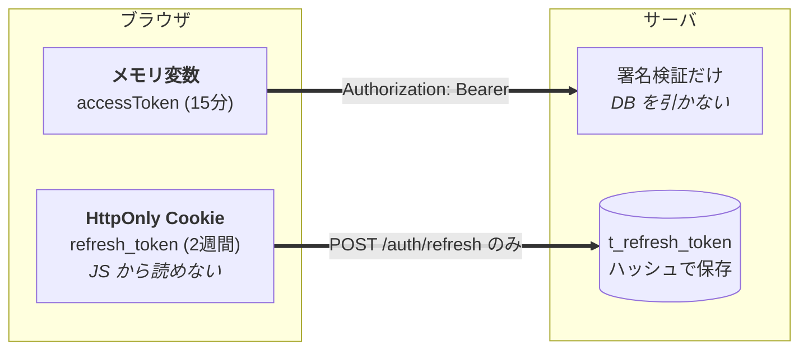
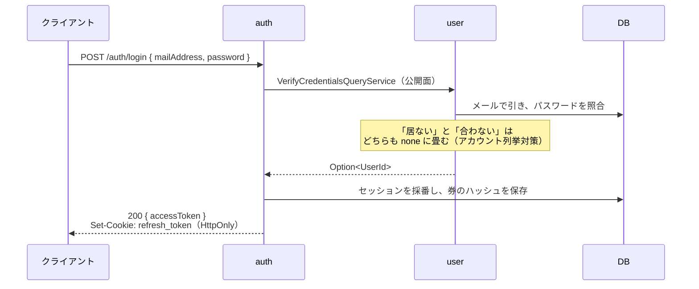
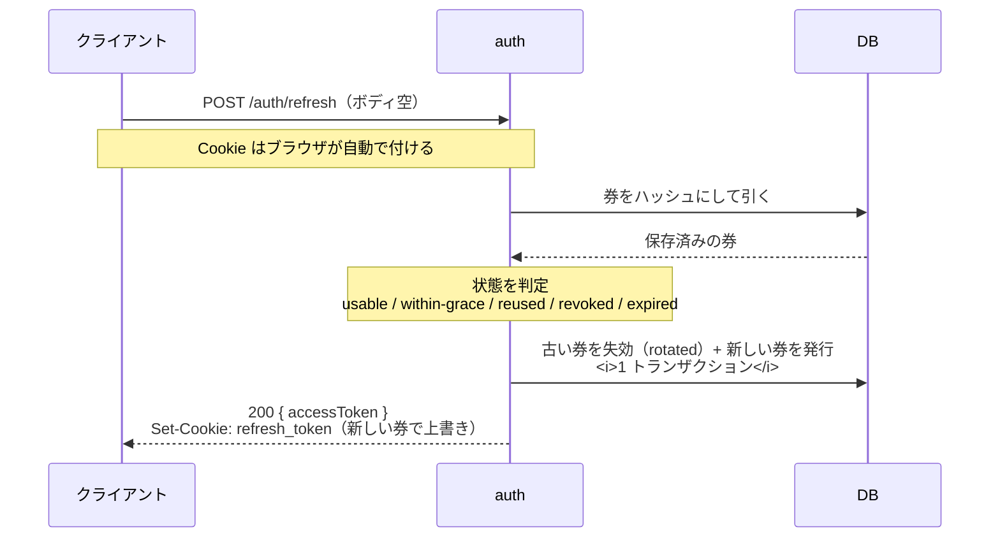
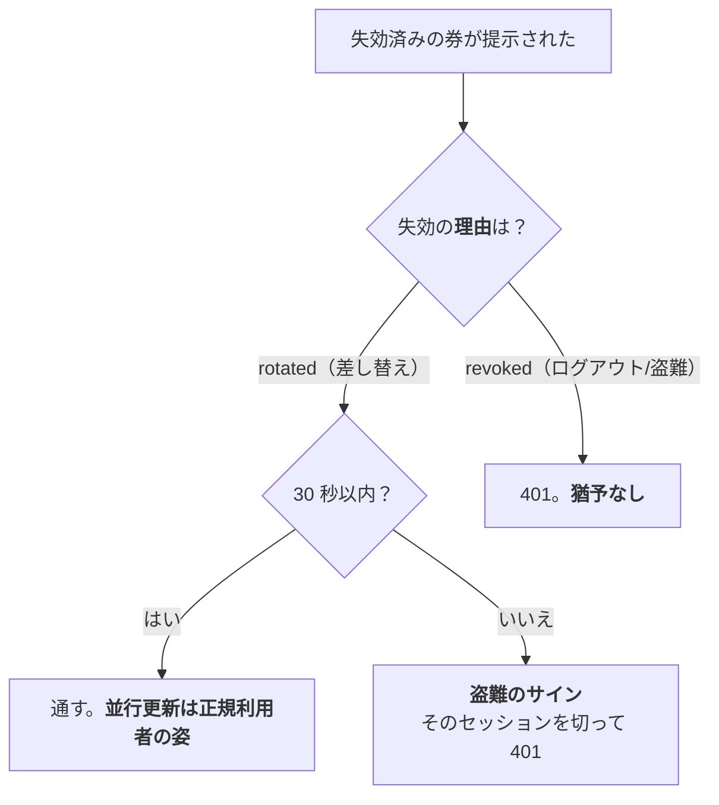

# 認証

**動いている形を一望するための章。** 判断の経緯は
[`../05-auth/`](../05-auth/) にあるので、ここでは結論と流れだけを書く。

|            |                                                                                                         |
| ---------- | ------------------------------------------------------------------------------------------------------- |
| 深掘り     | [`05-auth/00-authentication-methods.md`](../05-auth/00-authentication-methods.md)（方式そのものの解説） |
| 判断の記録 | [`05-auth/01-our-approach.md`](../05-auth/01-our-approach.md)（何を選び、なぜそうしたか）               |

---

## 券は 2 枚。運び方が違う



|        | アクセストークン            | リフレッシュトークン             |
| ------ | --------------------------- | -------------------------------- |
| 形式   | JWT（HS256）                | 不透明トークン（ランダム文字列） |
| 寿命   | **15 分**                   | **2 週間**                       |
| 置き場 | JS のメモリ                 | **HttpOnly Cookie**              |
| 運び方 | `Authorization: Bearer`     | ブラウザが自動送信               |
| 検証   | 署名だけ。**DB を引かない** | ハッシュを DB に引き当てる       |
| 失効   | できない（寿命切れ待ち）    | **できる**                       |

要件が正反対の 2 つを別の券に割り当てている。毎リクエスト走る検証は速く、
失効はログアウト時だけなので DB を叩いてよい。

**代償: ログアウトは最大 15 分効かない。** アクセストークンは DB を見ないため。

---

## なぜ Bearer 一本をやめたか

**2026-08-14 に変更。** それまでは 2 枚とも JSON のボディで受け渡していた。

```text
旧: LoginResponse { accessToken, refreshToken }   ← JS が両方を保持する
    RefreshRequest { refreshToken }               ← JS が手でボディに入れて送る
```

### 理由は XSS

```text
JS が 2 週間有効な券を保持する
  → XSS を 1 回踏んだ瞬間、その券が盗まれる
  → 攻撃者は 2 週間、更新し放題になる
```

`05-auth/01-our-approach.md` 自身が「契約がボディで受け渡す形なので**置き場が
盗まれやすく**、『盗まれたと気付ける』価値が相対的に高い」と書いてローテーションを
採用していた。**その前提条件のほうを潰した**、というのが変更の実体。

HttpOnly にすれば JS から読めないので、XSS を踏んでも**盗まれるのは最大 15 分の券だけ**。

### 心配ごとが 1 つ消えて 1 つ増える

**最適化ではなく、交換。**

|              | 得る                                 | 失う                            |
| ------------ | ------------------------------------ | ------------------------------- |
| Bearer 一本  | CSRF を考えなくてよい / 実装が単純   | **XSS で 2 週間の券が盗まれる** |
| **いまの形** | **XSS で盗まれるのは 15 分の券だけ** | **CSRF という考慮事項が増える** |

CSRF は `SameSite=Lax` + CORS の Origin 制限でほぼ塞がる。
**「XSS のほうが CSRF より怖い」という重み付けを採った**、というのが判断の実体。

### なぜ今だったか

引き金は「フロントの構成が決まったとき」と決めてあり、それが引かれた。
別リポジトリ（`aws-infra-practice` の `full-stack-ts-aws-ecs`）で
React SPA + サブドメイン分離が固まったため。

**クライアントが 1 つも無いうちにやる必要があった。** `LoginResponse` の形が変わる
破壊的変更なので、フロントを書いた後だと移行コストが跳ね上がる。

---

## 流れ

### ログイン



**auth は user の内部を知らない。** 公開面のポート 1 本だけを見る
（[`★境界と越境/`](../★境界と越境/)）。パスワードのハッシュは境界を越えない。

### 更新（ローテーション）



**セッション（`sid`）は据え置く。** 採番し直すと更新のたびにログアウトの単位が変わり、
古いタブからのログアウトが効かなくなる。

### ログアウト

```mermaid
sequenceDiagram
  participant C as クライアント
  participant A as auth
  participant D as DB

  C->>A: POST /auth/logout（Authorization: Bearer）
  A->>D: sid でセッションの券をすべて失効（revoked）
  A-->>C: 204 + Set-Cookie: refresh_token=; Max-Age=0
```

**Cookie も消す。** サーバ側で失効させても、消さなければブラウザは 2 週間送り続ける。
届いた失効済みの券は盗難検出のログをノイズで埋める。

### 盗難検出



**猶予期間は理由で判定する。** 時刻だけで見ると、ログアウトや盗難検出で切った券にも
猶予が付き、**切ったはずのセッションが生き返る**（実際に踏んだ。経緯は
[`05-auth/01-our-approach.md`](../05-auth/01-our-approach.md#猶予期間は失効の理由で判定する)）。

**切る範囲はそのセッションだけ。** 猶予を入れてもなお誤検出は起こりうるので
（時計のずれ、遅い経路）、全セッションを切ると正規利用者が全端末から締め出される。

---

## 押さえること

### Cookie の属性

```text
HttpOnly              JS から読めない ← 移行した理由そのもの
Secure                既定で付ける。外すのは http:// のローカルだけ
SameSite=Lax          CSRF の主要な防御
Path=/auth/refresh    更新以外には一切飛ばない ← 漏洩面を最小化
Max-Age=1209600       2 週間。DB の expires_at と揃える
```

**属性を書いてよいのは
[`refresh-cookie.ts`](../../src/contexts/auth/presentation/refresh-cookie.ts) の 1 箇所だけ。**
発行と削除が同じ関数を通るので、`Path` や `Domain` がズレようがない。
1 つでも違うとブラウザは**別の Cookie**とみなし、**消したつもりで残る**。

### 決めた値

|                      |                    | 理由                                                     |
| -------------------- | ------------------ | -------------------------------------------------------- |
| アクセストークン     | 15 分              | 短いほど失効が速いが、更新＝ DB アクセスが増える         |
| リフレッシュトークン | 2 週間             |                                                          |
| 猶予期間             | 30 秒              | 短いほどタブ跨ぎの並行更新で正規利用者を締め出す         |
| 署名                 | HS256              | 発行と検証が同じプロセス。非対称が要るのは別サーバのとき |
| 盗難時に切る範囲     | そのセッションだけ | 誤検出で全端末を締め出さない                             |

### 環境変数

```text
JWT_SECRET      32 文字以上。短い鍵は割られても正常に見えるので起動時に長さごと検証
COOKIE_SECURE   既定 true。ローカル（http://）だけ false
COOKIE_DOMAIN   未設定なら発行したホストのみ。サブドメイン共有時だけ設定
```

いずれも**起動時に読む**。揃わなければ起動しない（リクエストを受けてからではない）。

---

## まだ入れていないもの

**CORS。** フロントが無いので検証する相手がいない。移植先で
`origin` と `credentials: true` を入れる。

> ⚠️ **`credentials: true` と `Access-Control-Allow-Origin: *` は仕様上併用できない。**
> クライアント側も `fetch(url, { credentials: 'include' })` が要る。
> 「Cookie が送られない」の原因はほぼこの 2 つ。
